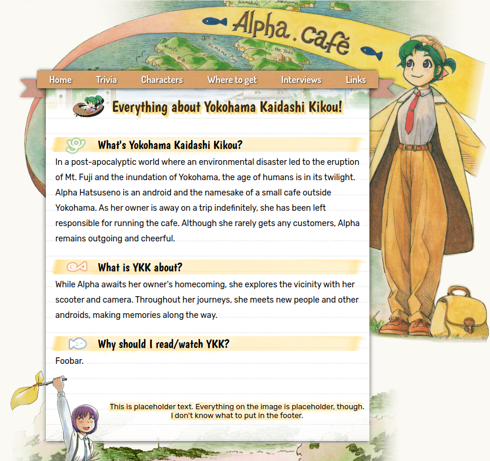

# alpha.cafe

Old school fansite for the manga **Yokohama Kaidashi Kikou**. Borrows elements from late-00s websites incl.:

- Compact design using small fonts and minimal empty space between elements.

- Narrow max width (relative to modern resolutions).

- Emphasis on copy over slogans, titles, and images.

This is both purposeful nostalgia and genuine personal preference. Modern webdesign is still used, e.g.:

- CSS3 properties such as box-shadow, border-radius, transition, and even flexbox.

- CSS functions (var(), calc(), rgba(), linear-gradient()...).

- Full responsiveness using media queries.

- SCSS.

- HTML5 with semantic elements.

A few additional principles I applied:

### Coding-wise
Simple HTML with emphasis on separation of concerns. Meaningless non-semantic markup (e.g. "wrapper" elements) must be employed as a last resort. HTML must, ideally, be fully understandable without comments.

Amply commented SCSS with the aim to be understood by third parties. Elements higher on the page are located higher in the code and properties are sorted alphabetically. Repetition must be minimized. Themability must be maximized.

### Writing-wise
Simple vocabulary and concise phrasing. Cutting out information is acceptable if the resulting prose has a higher "interesting information÷text length" ratio. Thematic sections must follow crisp headings so users can easily find information relevant to them.

### Loading times
Optimizing loading times is crucial for user experience (and bounce rate).

- Global image assets are compressed and take no more than 500KB.

- Full version of gifs are loaded on-demand using the `loading="lazy"` attribute, and hiding them by moving them out of the viewport (`left: -9999px`)
instead of using `display` or `visibility`. This prevents loading the gifs from delaying the loading of the rest of the page, and saves bandwidth.
- - While this doesn't use JS, for anti-tracking reasons this only works with JS enabled. As fallback, the experimental `importance="low"` attribute is used, hinting the browser to load those images last.

- gif thumbnails are compressed to a 1.1MB total, and are also set to `importance="low"` and `loading="lazy"` to load the site layout and content as early as possible.

### CSS full-size image viewer

- Figure thumbnails can be enlarged with a click. The full version will appear in the center of the screen above a black overlay. This can be closed by clicking anywhere.
- - This is achieved without JS by wrapping the image in a checkbox label. While initial testing showed no glaring accessibility issue, further tests are desirable.

TBC
